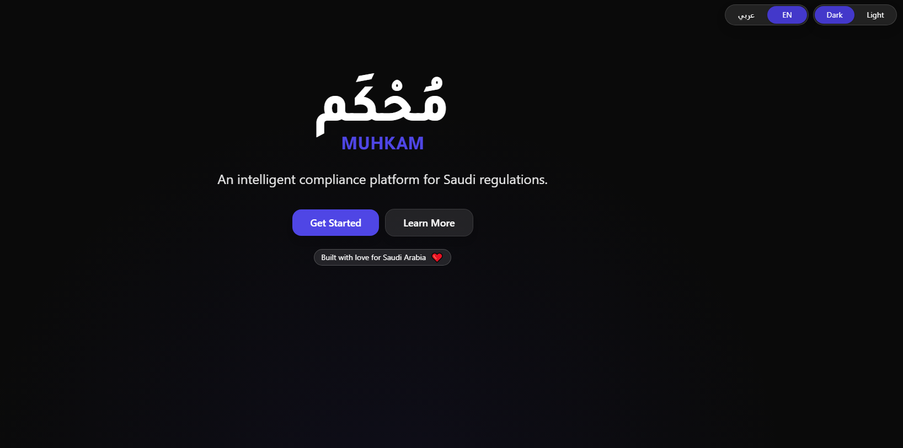

# MUHKAM – AI Compliance Agent for Sdaia Regulations

MUHKAM (Arabic: **مُحْكَم**) is a **smart compliance platform** tailored for organisations operating in the Kingdom of Saudi Arabia.  It helps you audit internal documents, databases and scanned records against local privacy and cybersecurity frameworks—such as the **Personal Data Protection Law (PDPL)** and the **National Cybersecurity Authority (NCA)** Essential Cybersecurity Controls—using large‑language models and retrieval‑augmented generation.

The platform allows users to upload contracts, policies, logs or databases, automatically extracts text (including from scanned PDFs via OCR), compares the content against official regulations, detects sensitive data such as emails or national IDs, and produces structured reports.  A conversational interface powered by OpenAI GPT models lets you ask questions about your documents and the relevant regulations.




## Features

MUHKAM aims to simplify compliance for Saudi organisations by providing the following capabilities:

- **Document uploads** – Send policies, contracts, reports, log files or even database exports to the system for analysis.  Documents are stored in Supabase (or Google Cloud Storage) and indexed for retrieval.
- **OCR for scanned files** – A Google Cloud Vision OCR pipeline extracts text from scanned PDFs and images so you can audit legacy documents.
- **Regulation comparison** – Use retrieval‑augmented generation (RAG) to cross‑reference your content against PDPL and NCA ECC articles.  The system highlights potential violations and cites the relevant regulation.
- **Sensitive data detection** – Built‑in rule‑based and LLM‑assisted detectors flag personal data such as email addresses, Saudi national IDs, phone numbers, and IBANs.
- **Interactive Q&A** – Ask conversational questions about your uploaded content or about specific regulations via a chat interface backed by OpenAI GPT and ChromaDB.
- **Detailed reporting** – Generate HTML or PDF reports summarising compliance status per document and per regulation.  Reports can be downloaded or embedded into your workflows.
- **Modern web interface** – A React/TypeScript frontend built with Vite and Tailwind CSS provides a dark‑mode console for uploads, chats and viewing reports.

## Tech Stack

| Layer            | Tools / Frameworks                                       |
|------------------|----------------------------------------------------------|
| Frontend         | React + Vite + TypeScript, Tailwind CSS                  |
| Backend API      | FastAPI (Python 3.10+)                                   |
| OCR              | Google Cloud Vision OCR                                  |
| LLM              | OpenAI GPT models via API                                |
| Embedding model  | `text-embedding-3-large via OpenAI`                      |
| Vector store     | ChromaDB                                                 |
| RAG framework    | LangChain with RouterRAG                                 |
| File storage     | Supabase Storage or Google Cloud Storage                 |
| Report output    | HTML and PDF via FastAPI endpoints                       |

## Project Structure

The repository is split into a **backend** and **frontend**.  A brief overview of the top‑level layout is shown below:

```
AI_Compliance_Assistant_project-master/
├── backend/               # FastAPI backend
│   ├── app/               # API entrypoint and routers
│   ├── chroma_db/         # Prebuilt indices of regulations
│   ├── data/              # Demo files  
│   ├── .env               # Environment variables 
│   └── requirements.txt   # Python dependencies
│
├── frontend/              # React + Vite frontend
│   ├── src/               # Components, pages and API client
│   ├── public/            # Static assets
│   ├── .env               # Frontend configuration 
│   └── package.json       # Node dependencies
│
├── docs/
│   ├── Muhkam_documentation.docx  # Muhkam_documentation
    └── homepage.png               # Screenshots of the app
│
└── README.md              # You are reading it!
```

## Installation

To run MUHKAM locally you will need **Python 3.10+** and **Node 16+** installed.  The backend and frontend are separate services; you can run them individually or together depending on your needs.


### Backend Setup

1. Navigate to the `backend` directory:

   ```bash
   cd backend
   ```

2. Create a Python virtual environment and activate it:

   ```bash
   python -m venv .venv
   source .venv/bin/activate
   ```

3. Install the Python dependencies:

   ```bash
   pip install --upgrade pip
   pip install -r requirements.txt
   ```

4. Copy the sample environment file and edit it with your own credentials:

   ```bash
   cp .env .env.local
   # Open .env.local in your editor and set:
   #   OPENAI_API_KEY=...
   #   SUPABASE_URL=...
   #   SUPABASE_ANON_KEY=...
   #   GOOGLE_APPLICATION_CREDENTIALS=path/to/your-gcp-key.json
   #   FRONTEND_ORIGIN=http://localhost:5173
   # The .env file is intentionally not committed to git for security reasons.
   ```

5. Start the API using Uvicorn:

   ```bash
   uvicorn app.main:app --host 0.0.0.0 --port 8000 --reload
   ```

   This will start the FastAPI server on `http://localhost:8000`.

### Frontend Setup

1. Navigate to the `frontend` directory:

   ```bash
   cd frontend
   ```

2. Install Node dependencies:

   ```bash
   npm install
   ```

3. Copy the example environment file and set the API URL:

   ```bash
   cp .env.example .env
   # In .env set:
   #   VITE_API_URL=http://localhost:8000
   ```

4. Start the development server:

   ```bash
   npm run dev
   ```

   By default the app will be served on `http://localhost:5173`.  When both the backend and frontend are running you can open this URL in your browser to access the MUHKAM console.

## Configuration

The system relies on several environment variables.  The most important ones are:

- **OPENAI_API_KEY** – API key for OpenAI, required for chat and embeddings.
- **SUPABASE_URL** and **SUPABASE_ANON_KEY** – Your Supabase project URL and public anon key for database and storage.
- **FRONTEND_ORIGIN** – Allowed origin for CORS; set to your frontend URL (e.g. `http://localhost:5173`).
- **GOOGLE_APPLICATION_CREDENTIALS** – Path to your Google Cloud service account JSON key used for Vision OCR.
- **DISABLE_PERSISTENT_CACHE** – If set to `true`, documents are not cached locally.  This might be useful in serverless environments.

For a complete list of settings refer to the `.env` file in the `backend` directory and the comments in `app/main.py`.

## Usage

Once both services are up and running you can interact with MUHKAM through the web UI.

### Using the Web Console

1. Open your browser and navigate to `http://localhost:5173`.
2. Use the **Get Started** button to upload a PDF, Word document or text file.  Supported file types include `.pdf`, `.docx`, `.txt` and `.csv`.
3. After upload, you can:
   - Run a **Policy Audit** to compare the document against PDPL and NCA regulations.
   - Use **Sensitive Data Detection** to find personal or financial data.
   - Enter the **Chat** tab to ask free‑form questions about your document or about the regulations themselves.
   - View or download a detailed compliance **Report**.


## Examples

Below is a minimal example that demonstrates how to run MUHKAM with sample data:

```bash
# In one terminal: start the backend
cd backend
source .venv/bin/activate
uvicorn app.main:app --reload

# In another terminal: start the frontend
cd frontend
npm run dev

# Open your browser and upload `backend/data/sample_policy.pdf`
# Then click "Policy Audit" to generate a report.
```


---

© 2025 MUHKAM / Smart DataGuard.  
